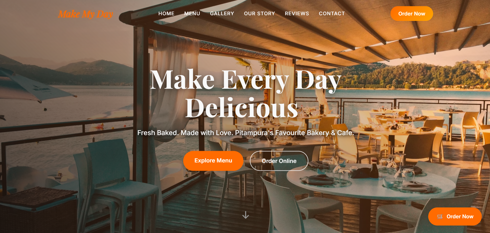

# 🍽️ Make My Day

A modern and responsive bakery & café website developed for **Make My Day**, a popular bakery and fast-food café in Pitampura, New Delhi. The website provides an engaging user experience with a modern landing page, menu showcase, gallery, customer reviews, and online ordering options.

## 🌐 Live Demo

🔗 https://make-my-day-website.vercel.app/

---

## 📸 Preview



---

## ✨ Features

- Modern and responsive landing page
- Smooth navigation across sections
- Food menu showcase
- Image gallery
- Customer reviews section
- Contact information
- Call-to-action buttons for online ordering
- Mobile-friendly design

---

## 🛠️ Tech Stack

- HTML5
- CSS3
- JavaScript

---

## 📂 Project Structure

```text
Make-My-Day-website/
│── index.html
│── assets/
│   └── preview.png
└── README.md
```

---

## 🚀 Deployment

The project is deployed on **Vercel** for fast and reliable hosting.

---

## 📌 Project Purpose

This project was created as a frontend website for a local bakery & café to showcase its brand, menu, customer experience, and simplify customer engagement through an attractive and responsive web interface.

---

## 👨‍💻 Author

**Krishna Gupta**

GitHub: https://github.com/gitkrishna18
